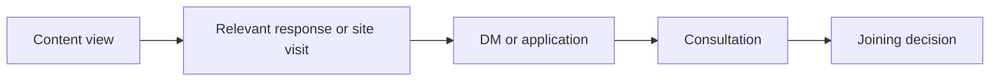

# Creator journey measurement

- Status: operating contract; establish a baseline before judging content
- Owner: Flair owner
- Review cadence: monthly, using the previous complete calendar month
- Scope: corporate site, note, X, TikTok DM and application, consultation, and joining decision

## Purpose and boundary

Measure whether media helps a prospective creator move from useful content to an informed joining decision:



This is directional attribution, not proof that one article caused a decision. Do not send names, handles, message text, contact details, contract details, or other personal data to analytics tools. Keep operational records containing personal data in their approved private system; the monthly media record receives only aggregate counts and a non-identifying attribution classification.

## Attribution contract

Use first-party aggregate analytics for site activity and platform-native aggregate analytics for note and X. UTM parameters may identify a public channel, account role, campaign, and content item, but never a person.

| Parameter | Allowed value | Rule |
| --- | --- | --- |
| `utm_source` | `note`, `x`, `tiktok`, or another actual platform | Source platform, not an individual |
| `utm_medium` | `organic`, `profile`, `dm`, or `referral` | Stable controlled vocabulary |
| `utm_campaign` | A documented initiative such as `creator_education` | Reuse across related content; no personal data |
| `utm_content` | Public content ID plus CTA position, such as `n6a165826ad75_faq` | Prefer a stable public ID over a mutable title |

Do not add UTMs to internal corporate-site links. A DM reply, consultation, or joining decision may be classified from the candidate's voluntary answer to “Flairをどこで知りましたか” and the available public referrer; do not inspect private messages solely to reconstruct attribution.

Use one of these attribution classes in the aggregate monthly review:

- `directly_observed`: a tracked transition or explicit voluntary source answer exists;
- `assisted`: media was mentioned or observed in the journey, but causation is not established;
- `unknown`: no reliable source evidence exists.

Never force an unknown journey into a media source and never sum media-attributed business value into direct media revenue.

## Event contract

For new GTM/GA4 configuration, use one event name, `creator_funnel_transition`, with controlled parameters. Existing `click_apply`, `click_dm`, and `click_cta` events remain in place until GTM reports and downstream consumers are migrated and verified.

| Parameter | Values | Example |
| --- | --- | --- |
| `funnel_stage` | `content_view`, `site_visit`, `content_inspection`, `contact_intent`, `consultation`, `joining_decision` | `contact_intent` |
| `action` | `view`, `click`, `start`, `complete`, `decline`, `defer` | `click` |
| `channel` | `corporate_site`, `note`, `x`, `tiktok_dm`, `application`, `consultation`, `operations` | `application` |
| `account_role` | `corporate`, `personal`, `not_applicable` | `corporate` |
| `content_id` | Public stable identifier or `not_applicable` | `n6a165826ad75` |
| `cta_id` | Stable placement and destination | `creator_contact_apply` |
| `candidate_state` | Values defined below or `unknown` | `checking_terms` |

Browser events cover only observable clicks and views. `consultation` and `joining_decision` events are monthly aggregate operational records, not browser events. Do not upload user-level operational rows to GA4.

### Current-to-target mapping

| Current event | Target stage/action | Target CTA |
| --- | --- | --- |
| `click_cta` / `cta_how-to-start_to_contact` | `content_inspection` / `click` | `creator_flow_contact_options` |
| `click_apply` / `cta_hero_to_apply` | `contact_intent` / `click` | `creator_hero_apply` |
| `click_apply` / `cta_contact_to_apply` | `contact_intent` / `click` | `creator_contact_apply` |
| `click_dm` / `cta_contact_to_dm` | `contact_intent` / `click` | `creator_contact_dm` |

## Candidate states and core metrics

Assign a candidate state only when the page, content purpose, or operational step supplies enough evidence. Otherwise use `unknown`.

| Candidate state | Primary question | Core monthly metrics |
| --- | --- | --- |
| `unaware` | Are relevant people discovering Flair? | note article PV at comparable age, X impressions, corporate-site landing sessions |
| `interested` | Do they seek more context? | article-to-site transitions, profile visits, relevant replies, repeat content response |
| `checking_terms` | Do they inspect conditions and support? | Creator-page engaged sessions, term/support article transitions, contact-options inspection clicks |
| `ready_to_consult` | Do they initiate a conversation or application? | DM clicks, application clicks, aggregate new inquiries, inquiry-to-consultation rate |
| `deciding` | Can they reach an informed decision? | consultations completed, decisions recorded, consultation-to-decision time |
| `joined_or_declined` | What was the outcome without hiding negative evidence? | joined, declined, deferred, and unknown outcomes; consultation-to-join rate |

Report counts before rates and show `unknown` alongside attributed results. Use a rate only when its numerator and denominator cover the same period and population. Small counts must not be presented in a way that could identify a candidate.

### Consultation outcome cohort

Do not divide decisions recorded in a month by consultations completed in that same month. Define each cohort by the calendar month in which consultation was completed (`Asia/Tokyo`) and observe its outcome for 90 days from each consultation date. Calculate the privacy-safe aggregate in the approved operational system before adding it to the media review:

```text
90-day consultation-to-join rate
= members of the consultation cohort recorded as joined within 90 days
/ all completed consultations in that cohort
```

For cohorts of at least five completed consultations, report joined, declined, deferred, still pending, and unknown outcomes for the same cohort. Mark a rate as provisional until every member has reached the 90-day boundary; compare only equally matured cohorts. Do not export candidate-level dates or outcomes to analytics.

When a cohort contains fewer than five completed consultations, keep the entire rate and outcome breakdown in the access-restricted operational system. The media review records only that the sample is too small; it must not include the cohort's rate, individual outcome counts, or a segmentation that could reconstruct them. Combine cohorts only across a predefined, documented period—not selectively after seeing their outcomes—and retain the original 90-day observation rule.

## Monthly review

The Flair owner is initially accountable for the review and may assign preparation without transferring the decision. Review the previous complete calendar month by the tenth business day.

1. Freeze the period and metric definitions used.
2. Record corporate-site, note, and X aggregate observations by account and content item.
3. Add aggregate inquiry and consultation counts, plus matured consultation-cohort outcomes calculated in the approved operational system.
4. Compare against the baseline and trailing three complete months; do not treat one spike as a trend.
5. Record one `continue`, `change`, `stop`, or `investigate` decision with its evidence and owner.
6. Record missing data and instrumentation changes before interpreting movement.

## Baseline

The first baseline is the first complete calendar month after this contract and its required GTM configuration are verified in production. Preserve:

- the date range and timezone (`Asia/Tokyo`);
- active content and CTA inventory;
- event names and parameter definitions;
- aggregate counts for every core funnel transition, including zero and unknown;
- known platform-reporting delays and unavailable metrics; and
- any instrumentation outage or content launch that makes the month atypical.

Do not backfill a “baseline” from incompatible legacy events. Legacy `click_*` events may be recorded separately as pre-contract context. Do not judge content performance until one complete baseline month exists; prefer three complete comparable months before reallocating material effort.

## Known gaps

- note and X do not expose a shared user identity with the corporate site, and Flair should not create one for this purpose.
- An outbound click proves intent to leave the page, not that a DM, application, or consultation completed.
- TikTok and other apps may remove referrer or UTM context.
- A candidate may read on one device or account and contact Flair through another.
- Word of mouth, prior relationships, scouting, and repeated media touches make single-source attribution incomplete.
- Platform metric definitions, availability, and reporting windows may change.
- Joining decisions can occur well after consultation; same-month ratios can undercount or overcount by mixing different cohorts.
- Low volumes make percentages volatile and can create privacy risk.

These gaps are reporting constraints, not values to estimate away. Use `unknown`, retain the evidence actually observed, and describe attribution as directional.

## Implementation and verification checklist

- [ ] Configure `creator_funnel_transition` in GTM/GA4 without personal-data parameters.
- [ ] Map and verify the four current Creator-page CTA events before retiring legacy reports.
- [ ] Add privacy-safe UTMs to new note and X links into the Creator page.
- [ ] Verify events in production debug/realtime tools without submitting a real application or sending a real DM.
- [ ] Record the first complete baseline month using the contract above.
- [ ] Review retention and access controls for analytics and the private operational source.
