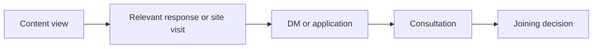

# Creator journey measurement

- Status: operating contract; establish a baseline before judging content
- Owner: Flair owner
- Review cadence: monthly, using the previous complete calendar month
- Scope: corporate site, note, X, TikTok DM and application, consultation, and joining decision

## Purpose and boundary

Measure whether media helps a prospective creator move from useful content to an informed joining decision:



This is directional attribution, not proof that one article caused a decision. Do not send names, handles, message text, contact details, contract details, or other personal data to analytics tools. Keep operational records containing personal data in their approved private system; the monthly media record receives only aggregate counts and a non-identifying attribution classification.

## Attribution contract

Use first-party aggregate analytics for site activity and platform-native aggregate analytics for note and X. UTM parameters may identify a public channel, account role, campaign, and content item, but never a person.

| Parameter | Allowed value | Rule |
| --- | --- | --- |
| `utm_source` | `note`, `x`, `tiktok`, or another actual platform | Source platform, not an individual |
| `utm_medium` | `organic`, `profile`, `dm`, or `referral` | Stable controlled vocabulary |
| `utm_campaign` | A documented initiative such as `creator_education` | Reuse across related content; no personal data |
| `utm_content` | Public content ID plus CTA position, such as `n6a165826ad75_faq` | Prefer a stable public ID over a mutable title |

Do not add UTMs to internal corporate-site links. A DM reply, consultation, or joining decision may be classified from the candidate's voluntary answer to “Flairをどこで知りましたか” and the available public referrer; do not inspect private messages solely to reconstruct attribution.

Use one of these attribution classes in the aggregate monthly review:

- `directly_observed`: a tracked transition or explicit voluntary source answer identifies the reported source;
- `assisted`: media appears only as contextual journey evidence and no evidence qualifies as `directly_observed` for the reported source;
- `unknown`: no reliable source evidence exists.

Apply the classes in that order of precedence and assign exactly one class per candidate in a record set. Evidence that qualifies as `directly_observed` must not also be counted as `assisted`; `assisted` is reserved for the remaining contextual evidence. These classes describe evidence strength, not causation.

Never force an unknown journey into a media source and never sum media-attributed business value into direct media revenue.

### Primary-source rule

Operational source reporting is a mutually exclusive first-discovery classification, not multi-touch credit:

1. Use the candidate's single voluntary answer to “Flairを最初にどこで知りましたか” when one is provided.
2. Otherwise use the earliest reliably observed tracked external transition in the retained journey evidence.
3. Otherwise use `direct`, `other`, or `unknown` as applicable.

If a voluntary answer names several sources without identifying the first, classify the primary source as `unknown`; retain the named media only as non-exclusive assisted context in the restricted operational record. Later note, X, site, scouting, or relationship touches never replace the frozen primary source and never add the same person to another primary-source segment. The primary-source segments therefore form one additive partition of the `all` cohort. Do not use this rule to claim that the selected source caused the outcome.

## Event contract

For new GTM/GA4 configuration, use one event name, `creator_funnel_transition`, with controlled parameters. Existing `click_apply`, `click_dm`, and `click_cta` events remain in place until GTM reports and downstream consumers are migrated and verified.

| Parameter | Values | Example |
| --- | --- | --- |
| `funnel_stage` | `content_view`, `site_visit`, `content_inspection`, `contact_intent` | `contact_intent` |
| `action` | `view`, `click` | `click` |
| `channel` | `corporate_site`, `note`, `x`, `tiktok_dm`, `application` | `application` |
| `account_role` | `corporate`, `personal`, `not_applicable` | `corporate` |
| `content_id` | Public stable identifier or `not_applicable` | `n6a165826ad75` |
| `cta_id` | Stable placement and destination, or `not_applicable` | Use `not_applicable` for `view` and any other transition that is not a CTA interaction |
| `candidate_state` | Values defined below or `unknown` | `checking_terms` |

Browser events cover only observable clicks and views. Consultation and joining decisions use the separate aggregate record below; they are not `creator_funnel_transition` events. Do not upload user-level operational rows or aggregate operational records to GA4.

### Aggregate operational record

Calculate this record in the approved, access-restricted operational system. Store no name, handle, contact detail, free text, or candidate-level date in the media review.

| Field | Allowed value | Rule |
| --- | --- | --- |
| `record_version` | Positive integer | Start at `1`; increment for each incompatible definition change |
| `record_version_effective_at` | ISO 8601 timestamp with offset | Immutable `Asia/Tokyo` month boundary scheduled and recorded before this version became active |
| `measurement_start_at` | ISO 8601 timestamp with offset | Immutable boundary recorded before production measurement starts |
| `metric` | `inquiry_count`, `consultation_count`, `inquiry_to_consultation_30d`, `consultation_to_join_90d` | One metric per record set |
| `cohort_start` / `cohort_end` | ISO calendar dates | Inclusive first and last dates of a predefined `Asia/Tokyo` period; timestamp interval is half-open |
| `observation_days` | `0`, `30`, or `90` | `0` for period counts; `30` or `90` for the matching cohort metric |
| `coverage_through` | ISO 8601 timestamp with offset | Minimum certified completeness watermark across every required input source |
| `reporting_lag_days` | Non-negative integer | Maximum allowance across every input source required by the metric, fixed before the cohort or count period starts |
| `attribution_snapshot_version` | Positive integer or `not_applicable` | Opaque aggregate snapshot version; never derived from a person or timestamp |
| `maturity` | `provisional`, `matured` | Published cohort and period-count records require `matured`; `provisional` exists only in the restricted queue until the applicable coverage gate passes |
| `outcome` | `not_applicable`, `consulted`, `not_consulted`, `joined`, `not_joined`, `declined`, `deferred`, `still_pending`, `unknown` | Period-count metrics require `not_applicable`; cohort metrics use matching outcomes only, with the two `not_*` values as predefined aggregate buckets |
| `count` | Non-negative integer or `suppressed` | `suppressed` for every period or cohort row with fewer than five members exposed to the media review |
| `cohort_denominator` | Non-negative integer, `not_applicable`, or `suppressed` | Same defined population for every cohort row; must be `not_applicable` for period-count metrics |
| `rate` | Decimal fraction from `0` through `1`, `not_applicable`, or `suppressed` | Store `0.6`, not `60`, for 60%; calculate only for the two cohort metrics and never from same-month counts |
| `attribution_class` | `directly_observed`, `assisted`, `unknown`, or `all` | Use `all` for the primary cohort; segment only when privacy rules permit |
| `source` | Controlled `utm_source`, `direct`, `other`, `unknown`, or `all` | Use `all` for the primary cohort; do not add free text |
| `campaign` | Documented public campaign ID, `not_applicable`, `other`, `unknown`, or `all` | Never encode a person or private relationship |
| `account_role` | `corporate`, `personal`, `not_applicable`, `other`, `unknown`, or `all` | Role, not an account handle |
| `content_id` | Public stable content ID, `not_applicable`, `other`, `unknown`, or `all` | Public identifier only |

A cohort result is a record set containing the denominator and its applicable outcome rows. The primary record uses `all` for attribution class and source dimensions. Optional attribution-class, source, campaign, account-role, or content segments are separate record sets. Expose only one segmentation dimension at a time. An attribution-class partition contains exactly `directly_observed`, `assisted`, and `unknown`; every other optional dimension uses a complete mutually exclusive partition that includes `unknown` and `other`. Every cell and the complement of every displayed cell or grouped cell must independently contain at least five cohort members. Do not publish cross-tabulated dimensions. If any cell, complement, or reconstructable grouping fails the threshold, coarsen the partition under a rule fixed before inspecting outcomes or expose only the `all` record.

For every optional dimension, take the value attached to the same frozen first-discovery evidence selected by the primary-source rule. Use `not_applicable` when that evidence type cannot carry the dimension, `other` when it carries a known value outside the published controlled buckets, and `unknown` when the value is missing or several values are tied at the selected first touch. Later touches never replace it. Thus each candidate enters exactly one cell in an exposed source, campaign, account-role, or content partition.

Before using a candidate in any published segmented cohort or period record, snapshot that candidate's attribution class and dimension values once in the restricted operational system. Reuse the immutable values in every later segmented record, including later consultation-count periods. The restricted system assigns each closed aggregate attribution snapshot a monotonically increasing, opaque `attribution_snapshot_version`; the media record receives only that version, never a candidate-level snapshot time or an identifier derived from a person or timestamp. Evidence obtained after a candidate snapshot, including a later voluntary answer about an earlier first touch, may remain in the restricted operational record but must not rewrite published attribution or create a second dimension key. A published segmented aggregate is never reclassified on recalculation. Unsegmented `all` records use `attribution_snapshot_version: not_applicable`.

For `consultation_to_join_90d`, assign each cohort member exactly one outcome from their effective status at the end of their individual 90-day observation window. A join completed by that boundary is `joined`, regardless of an earlier deferred or pending state. Otherwise use the latest recorded state at or before the boundary: closed without joining is `declined`, explicitly deferred and not later resumed is `deferred`, an open decision is `still_pending`, and absent or irreconcilable status evidence is `unknown`. Changes after the boundary belong to later operational reporting and do not rewrite the fixed 90-day cohort result. The outcome rows must therefore be mutually exclusive and sum to the cohort denominator before suppression.

The media review may receive a cohort record set only when it meets the minimum size. Otherwise the fixed outcome labels may remain, but every count, denominator, and rate is `suppressed`; source dimensions must be `all`, and only the metric, period, window, maturity, and “sample too small” status remain visible.

For a conversion rate, both its numerator and its complement must independently contain at least five members; otherwise suppress the rate and denominator. Publish an outcome breakdown only when every displayed outcome cell and its complement independently meet the same threshold. If a detailed breakdown fails this rule, the only permitted coarsening is the predefined binary partition: `consulted` / `not_consulted` for `inquiry_to_consultation_30d`, or `joined` / `not_joined` for `consultation_to_join_90d`. `not_consulted` combines every cohort member without a completed valid consultation by the boundary; `not_joined` combines `declined`, `deferred`, `still_pending`, and `unknown`. If either binary cell still fails the threshold, suppress the entire breakdown, including counts, denominator, and rate. Never expose a rate or complementary value that reconstructs a suppressed count.

Store the `inquiry_to_consultation_30d` conversion rate only on its `consulted` outcome row and the `consultation_to_join_90d` conversion rate only on its `joined` outcome row. Every other outcome row must use `rate: not_applicable`; do not store an outcome share or repeat the conversion rate on those rows.

Apply the same minimum of five to `inquiry_count` and `consultation_count` period records. When a period contains fewer than five unique candidates, expose only `count: suppressed` with every source dimension set to `all`; do not expose segments. For a permitted segmented period count, the complete-partition and complement rules above still apply.

Both period metrics count unique candidates, not events. `inquiry_count` counts only candidates whose lifetime-first valid inquiry occurs both in the period and on or after `measurement_start_at`; follow-up inquiries and candidates with a valid pre-start inquiry never enter that period count. `consultation_count` counts only candidates whose lifetime-first completed valid consultation occurs both in the period and on or after `measurement_start_at`; follow-up consultations and candidates with a valid pre-start consultation never enter that period count. Each population is identical to its matching cohort denominator before suppression, so subtracting the records cannot expose a small pre-start or repeat-event group. Period-count records use `cohort_denominator: not_applicable` and `rate: not_applicable`.

### Version migration

Exactly one `record_version` is active at any instant. Before an incompatible change, assign the next positive version a documented `record_version_effective_at` at 00:00 on the first day of a future calendar month in `Asia/Tokyo`; version intervals must be contiguous and must never overlap. Evaluate each event as a possible new lifetime-first marker under the version active when it occurs. Once an event establishes a candidate's lifetime-first valid inquiry or consultation marker, that marker is immutable across all later versions; later rule changes never invalidate it or create a second first event. Events rejected under their original version are never retroactively made valid, and a candidate excluded because lifetime-first status could not be established retains that exclusion unless an audited migration resolves the history before the new version becomes effective. Therefore, a candidate without an existing marker may acquire one only from a later event accepted under the version active at that later event. A candidate cohort keeps the version active at its qualifying lifetime-first event through maturation and publication. When a later event is tested as an outcome for that in-flight cohort, apply the cohort's assigned eligibility and outcome rules even if another version is then active; separately applying the current version to that event as a possible marker for a different metric does not change the earlier cohort. A period-count record uses the single version active for its entire calendar period, which is why changes may take effect only at a month boundary. Retain already published records unchanged under their original version, and finish queued cohorts under their assigned version; never recompute, duplicate, or replace them under a later version. Consumers select the one version whose effective interval contains the qualifying event or count period, so the same candidate, cohort, or period cannot be counted under two versions. Document any semantic discontinuity instead of combining incompatible versions into one trend.

### Current-to-target mapping

| Current event / label | `funnel_stage` | `action` | `channel` | `account_role` | `content_id` | `cta_id` | `candidate_state` |
| --- | --- | --- | --- | --- | --- | --- | --- |
| `click_cta` / `cta_how-to-start_to_contact` | `content_inspection` | `click` | `corporate_site` | `corporate` | `corporate_creator_page` | `creator_flow_contact_options` | `checking_terms` |
| `click_apply` / `cta_hero_to_apply` | `contact_intent` | `click` | `application` | `corporate` | `corporate_creator_page` | `creator_hero_apply` | `ready_to_consult` |
| `click_apply` / `cta_contact_to_apply` | `contact_intent` | `click` | `application` | `corporate` | `corporate_creator_page` | `creator_contact_apply` | `ready_to_consult` |
| `click_dm` / `cta_contact_to_dm` | `contact_intent` | `click` | `tiktok_dm` | `corporate` | `corporate_creator_page` | `creator_contact_dm` | `ready_to_consult` |

For this migration, `channel` identifies the transition destination for contact-intent events and the observed surface for on-site inspection events. Do not derive it from the current URL at runtime. The table is the complete parameter contract for these four legacy event/label pairs; an unmapped pair must remain on the legacy event until a reviewed mapping is added.

## Candidate states and core metrics

Assign a candidate state only when the page, content purpose, or operational step supplies enough evidence. Otherwise use `unknown`.

| Candidate state | Primary question | Core monthly metrics |
| --- | --- | --- |
| `unaware` | Are relevant people discovering Flair? | note article PV at comparable age, X impressions, corporate-site landing sessions |
| `interested` | Do they seek more context? | article-to-site transitions, profile visits, relevant replies, repeat content response |
| `checking_terms` | Do they inspect conditions and support? | Creator-page engaged sessions, term/support article transitions, contact-options inspection clicks |
| `ready_to_consult` | Do they initiate a conversation or application? | DM clicks, application clicks, aggregate new inquiries, inquiry-to-consultation rate |
| `deciding` | Can they reach an informed decision? | unique candidates completing a lifetime-first valid consultation and aggregate decisions recorded |
| `joined_or_declined` | What was the outcome without hiding negative evidence? | joined, declined, deferred, and unknown outcomes; consultation-to-join rate |

Report counts before rates and show `unknown` alongside attributed results. Use a rate only when its numerator and denominator cover the same period and population. Small counts must not be presented in a way that could identify a candidate.

### Inquiry and consultation cohorts

Before collecting production measurements, the Flair owner must record one exact `measurement_start_at` timestamp in the approved operational configuration. It is shared by all records, must not be inferred from contract adoption, GTM verification, or the first baseline month, and cannot change without a new `record_version` and an explicitly documented migration. Cohort eligibility uses this stored boundary.

Use exact instants for observation windows. Normalize the qualifying event timestamp and outcome event timestamp to UTC for comparison; `Asia/Tokyo` is used only to assign the qualifying event to a calendar cohort. The 30-day window is the closed interval from the qualifying inquiry instant through exactly `30 * 24` elapsed hours later, and the 90-day window is the closed interval from the qualifying consultation instant through exactly `90 * 24` elapsed hours later. An event at the exact ending instant is included; an event after it is excluded.

Interpret every cohort or count period as the half-open timestamp interval from 00:00 at `cohort_start` through, but not including, 00:00 on the calendar day after `cohort_end`, all in `Asia/Tokyo`. Call that next-midnight instant `period_end_exclusive`; add reporting lag as elapsed `24`-hour periods after converting the instant to UTC. A qualifying event exactly at `period_end_exclusive` belongs to the next period.

Before measurement begins, document the valid-inquiry and qualifying-consultation rules in the approved operational configuration and freeze both for the current `record_version`. A valid new inquiry is a genuine inbound request from a prospective creator about participation in or support from the agency. Exclude documented spam, internal tests, and exact duplicate delivery; do not exclude a person because they declined, did not reply, appeared unlikely to join, or later produced an unfavorable outcome. A completed valid consultation is a scheduled conversation between an actual prospective creator and an authorized Flair representative whose documented purpose includes evaluating or explaining participation in the agency, and whose operational status is completed. Exclude canceled appointments, no-shows, internal training or tests, and exact duplicate records. Do not exclude a completed consultation because of its duration, the candidate's perceived fit, later responsiveness, decision, or joining outcome. Any incompatible eligibility change requires a new `record_version` and documented migration.

Treat an event as lifetime-first only when the restricted operational system can establish that status from complete retained or migrated relationship history, or from a durable first-event marker maintained since the candidate's original ingestion. The absence of an earlier event in a truncated retention window is not evidence that the current event is first. If neither complete history nor a durable marker is available, exclude that candidate from every lifetime-first period count and cohort; record the exclusion internally as a data-quality gap, never as a media-review segment.

Do not divide consultations completed in a month by inquiries received in that same month. Use a unique-candidate inquiry cohort based on the candidate's established lifetime-first valid inquiry. A candidate is eligible only when that lifetime-first inquiry occurs on or after measurement begins, and enters exactly once in its calendar month (`Asia/Tokyo`). Fix that inquiry as the qualifying inquiry and observe whether the candidate completes consultation within 30 days of its receipt. Candidates with a valid pre-start inquiry are excluded; later follow-up or repeated inquiries do not create another cohort entry, reset the observation window, or receive credit for the same consultation:

```text
30-day inquiry-to-consultation rate
= members of the valid-inquiry cohort completing consultation within 30 days
/ all unique candidates whose qualifying inquiry is in that cohort
```

Keep the result provisional only in the access-restricted operational system until every cohort member has reached the 30-day boundary. Publish the cohort to the media review once, after maturity; do not publish provisional snapshots.

Do not divide decisions recorded in a month by consultations completed in that same month. Use a unique-candidate cohort based on the candidate's established lifetime-first completed valid consultation. A candidate is eligible only when that lifetime-first consultation occurs on or after measurement begins, and enters exactly once in its calendar month (`Asia/Tokyo`). Fix that consultation as the qualifying consultation and observe the candidate's outcome for 90 days from its completion date. Candidates with a valid pre-start consultation are excluded; later follow-up or repeat consultations do not create another cohort entry or reset the observation window. Calculate the privacy-safe aggregate in the approved operational system before adding it to the media review:

```text
90-day consultation-to-join rate
= members of the consultation cohort recorded as joined within 90 days
/ all unique candidates whose qualifying consultation is in that cohort
```

For consultation cohorts of at least five, report joined, declined, deferred, still pending, and unknown outcomes for the same cohort only when the outcome-specific privacy rule above permits it. Keep the result provisional only in the access-restricted operational system until every member has reached the 90-day boundary. Publish the cohort to the media review once, after maturity; do not publish provisional snapshots. Do not export candidate-level dates or outcomes to analytics.

When either an inquiry or consultation cohort contains fewer than five members, keep the entire rate and outcome breakdown in the access-restricted operational system. The media review records only the fixed outcome labels with suppressed values and that the sample is too small; it must not include the cohort's rate, outcome counts, source breakdown, or a segmentation that could reconstruct them. Combine cohorts only across a predefined, documented period—not selectively after seeing their outcomes—and retain the original 30-day or 90-day observation rule. Every combined period must lie wholly within one `record_version` effective interval, and all members must share that version; if a privacy threshold cannot be met without crossing a version boundary, keep the result suppressed rather than mixing semantics.

## Monthly review

The Flair owner is initially accountable for the review and may assign preparation without transferring the decision. Review the previous complete calendar month by the tenth business day.

1. Freeze the period and metric definitions used.
2. Record corporate-site, note, and X aggregate observations by account and content item.
3. Maintain an access-restricted maturation queue containing every inquiry or consultation cohort whose observation window or reporting-lag allowance has not closed. Before the cohort starts, identify every operational input required to calculate its denominator and outcomes and freeze `reporting_lag_days` as the maximum allowance across those sources. Each source must emit a certified completeness watermark that advances even when it contains zero qualifying events; set `coverage_through` to the minimum of those watermarks, never to the latest event date. Recalculate each queued cohort only through `coverage_through`. Set the base coverage boundary to the later of `period_end_exclusive` and the latest individual observation-window ending instant, then add the frozen lag. For an empty cohort, use `period_end_exclusive` alone as the base boundary. Only when `coverage_through` is on or after the resulting instant may the cohort be marked matured, published once as a privacy-safe aggregate, and removed from the queue. Never infer coverage from the current date and never copy a provisional snapshot into the media review. Use `record_version`, `measurement_start_at`, `metric`, cohort dates, observation days, `reporting_lag_days`, outcome, `attribution_snapshot_version`, and frozen exposed dimension values as the stable aggregate key, so a matured cohort cannot appear twice.
4. Add aggregate inquiry and consultation counts and newly matured 30-day and 90-day cohort results calculated in the approved operational system, subject to the small-cohort and outcome-specific restrictions above. Before each count period begins, identify its required input sources and freeze `reporting_lag_days` as their maximum allowance. Set `coverage_through` to the minimum certified completeness watermark across those sources and keep the period count as `provisional` in the restricted queue until it is on or after `period_end_exclusive` plus that allowance; then set `maturity: matured` and publish it once. Never publish a provisional count or derive either conversion rate from the raw same-month counts.
5. Compare against the baseline and trailing three complete months; do not treat one spike as a trend.
6. Record one `continue`, `change`, `stop`, or `investigate` decision with its evidence and owner.
7. Record missing data and instrumentation changes before interpreting movement.

## Baseline

The first baseline is the first complete calendar month after this contract and its required GTM configuration are verified in production. Preserve:

- the date range and timezone (`Asia/Tokyo`);
- active content and CTA inventory;
- event names and parameter definitions;
- aggregate counts for every core funnel transition, including zero and unknown;
- known platform-reporting delays and unavailable metrics; and
- any instrumentation outage or content launch that makes the month atypical.

Do not backfill a “baseline” from incompatible legacy events. Legacy `click_*` events may be recorded separately as pre-contract context. Do not judge content performance until one complete baseline month exists; prefer three complete comparable months before reallocating material effort.

## Known gaps

- note and X do not expose a shared user identity with the corporate site, and Flair should not create one for this purpose.
- An outbound click proves intent to leave the page, not that a DM, application, or consultation completed.
- TikTok and other apps may remove referrer or UTM context.
- A candidate may read on one device or account and contact Flair through another.
- Word of mouth, prior relationships, scouting, and repeated media touches make single-source attribution incomplete.
- Platform metric definitions, availability, and reporting windows may change.
- Joining decisions can occur well after consultation; same-month ratios can undercount or overcount by mixing different cohorts.
- Low volumes make percentages volatile and can create privacy risk.

These gaps are reporting constraints, not values to estimate away. Use `unknown`, retain the evidence actually observed, and describe attribution as directional.

## Implementation and verification checklist

- [ ] Configure `creator_funnel_transition` in GTM/GA4 without personal-data parameters.
- [ ] Map and verify the four current Creator-page CTA events before retiring legacy reports.
- [ ] Add privacy-safe UTMs to new note and X links into the Creator page.
- [ ] Verify events in production debug/realtime tools without submitting a real application or sending a real DM.
- [ ] Record the first complete baseline month using the contract above.
- [ ] Review retention and access controls for analytics and the private operational source.
